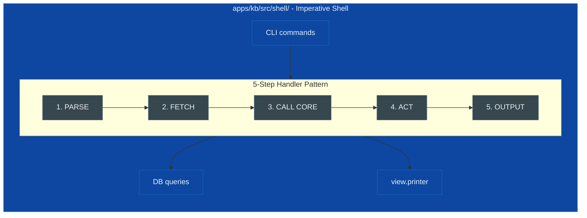
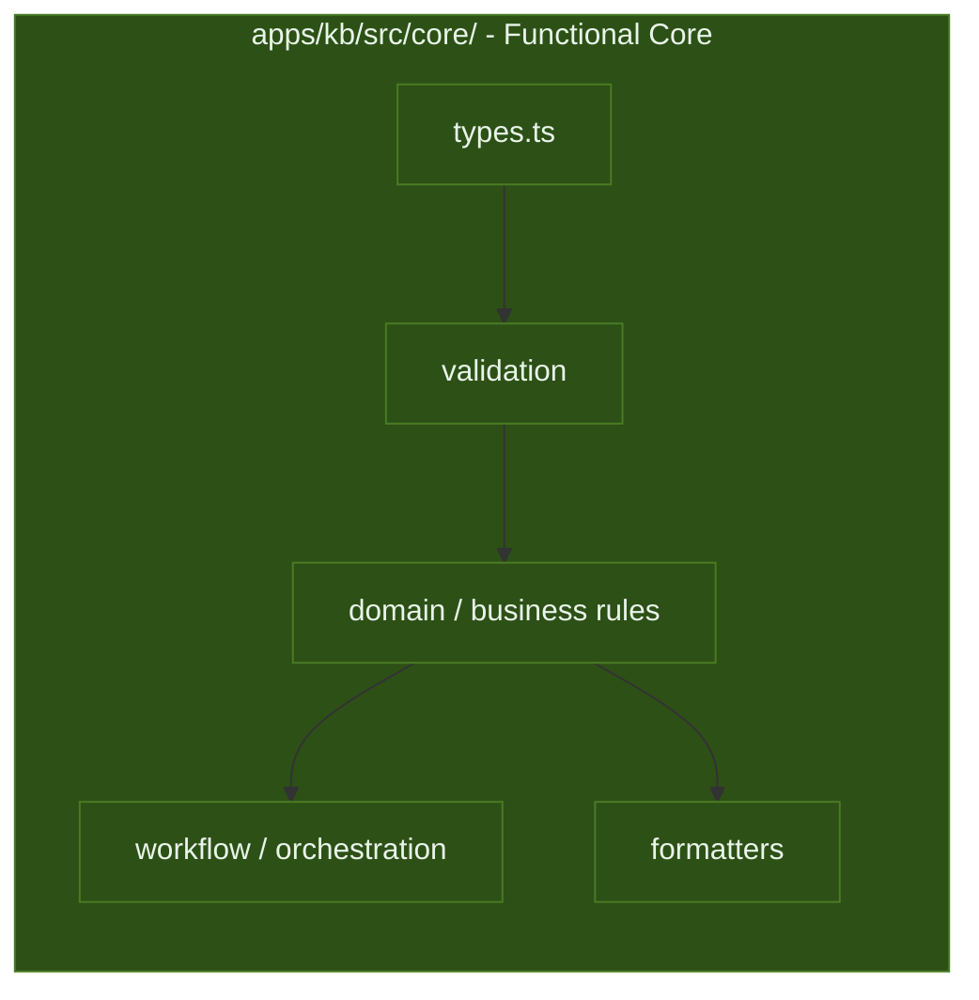

# FCIS - Functional Core, Imperative Shell Guidelines

Cursor does not auto-load this file; link from `.cursor/rules/codestyle.mdc` / `refactoring.mdc` when relevant.

**OVERVIEW**

> 💡 A pattern that splits your codebase into two hard zones:

| **ZONE**         | **LOCATION (KodexB CLI)**        | **RULE**                                          |
| ---------------- | ------------------------------- | ------------------------------------------------- |
| Functional Core  | `apps/kb/src/core/`             | Pure functions only. No I/O. No side effects.     |
| Imperative Shell | `apps/kb/src/shell/`           | All I/O lives here. Calls core to make decisions. |

Other workspace packages use their own trees (e.g. `@kb/kli` under `packages/kli/src/` with `core/` vs `shell/` inside that package). The **idea** is always the same: pure core, imperative shell; only the path prefix changes.

> 💡 **Shell (IMPURE)** fetches data, asks the core what to do, then acts on the answer.



> 💡 **(Core PURE)** never imports from shell. It calls core with data → gets Result back.



### Why Bother?

**Testability without ceremony:**

Core tests need zero setup - no mocks, no DB, no async. Plain object literals in, assertions out. If a test needs beforeEach or await, the function is in the wrong layer.

**Deterministic replay:**

Pure functions mean you can log inputs at the shell boundary and reproduce any production bug exactly - no database state, no timing, no environment to reconstruct.

**No framework lock-in at the core:**

The functional core (`apps/kb/src/core/` for KodexB) has zero runtime dependencies on the shell. Switching HTTP stack, ORM, or runtime touches only the shell. Business logic in core stays untouched.

**Parallel development:**

Once core types and signatures are defined, shell and business logic can be built simultaneously. The contract is just data in, data out.

**Free documentation:**

Pure function signatures are the spec. canTransitionTo(current: TaskStatus, next: TaskStatus): boolean tells you everything - no layer-tracing required.

**Safer code review:**

Any PR touching only `apps/kb/src/core/` cannot introduce a regression caused by I/O, timing, or external state. That's a meaningful trust boundary.

**Incremental adoption:**

No minimum viable structure. Extract one pure function from a messy handler and grow from there. Unlike DDD or clean architecture, it scales down.

## How It Compares

### vs. Clean Architecture / Hexagonal Architecture (Ports & Adapters)

**[Clean Architecture][2]** (Robert Martin) and **[Hexagonal Architecture][3]** (Alistair Cockburn) solve the same dependency problem - keep business logic independent of infrastructure - but through abstraction layers: interfaces, ports, adapters, and dependency injection containers.

**FCIS** gets there through data flow instead. No interfaces. No adapter classes. No DI framework. The core is isolated not by indirection, but because it literally only speaks in plain data types and pure functions.

| Dimension                 | **Clean / Hexagonal**     | **FCIS**                      |
| ------------------------- | ------------------------- | ----------------------------- |
| Isolation mechanism       | Interfaces + DI           | Pure functions + plain data   |
| Boilerplate               | Higher                    | Lower                         |
| Testability               | Good (often with mocks)   | Strong (core without mocks)   |
| Learning curve            | Steeper                   | Gentler                       |
| Best fit                  | Large, complex domains    | Small-to-medium TypeScript    |

> **Clean Architecture is powerful. FCIS is cheaper. Pick the one that matches your actual complexity.**

### vs. Domain-Driven Design (DDD)

**[DDD][4]** (Eric Evans, Domain-Driven Design, 2003) is a design philosophy - ubiquitous language, bounded contexts, aggregates, domain events. FCIS is an architectural pattern. They aren't competitors.

### Key differences:
- **[DDD][4]** encourages rich domain models—objects that encapsulate both data and behaviour (aggregates, entities, value objects with methods). FCIS enforces the opposite: data and behaviour are separate. A Task in FCIS is a plain type; `canTransitionTo` is a standalone function.
- You can apply DDD thinking (bounded contexts, ubiquitous language) to a FCIS codebase. But you cannot use rich OOP domain objects in the functional core (`apps/kb/src/core/` here) without violating the purity constraint.
- The classic Service → Repository → Database stack organises code by technical role. Business logic typically lives in a Service class that also coordinates I/O - calling repositories, dispatching events, logging. The layers are present, but the boundary between logic and I/O is blurry.

**FCIS** makes that boundary a hard rule. The equivalent of a Service is split in two: pure logic goes to the core (`apps/kb/src/core/`), orchestration goes to the shell (`apps/kb/src/shell/`). There's no "service that also does I/O" - that's the entire violation FCIS exists to prevent.

---

### vs. Functional Programming (pure FP)

Languages like Haskell enforce purity at the type system level - impure code must be declared as such (e.g. IO monad). FCIS is a convention-based approximation of that discipline in TypeScript. There's no compiler enforcement of the core/shell boundary - it relies on discipline and linting.

The tradeoff is pragmatism: you get most of the reasoning and testability benefits of pure FP without leaving the TypeScript ecosystem or retraining your team.

> **Gary Bernhardt's Boundaries talk (2012)** is the canonical introduction to this idea. His framing: push values to the edges, keep the centre pure.

---

### The Core (`apps/kb/src/core/`)

1. **ALLOWED:**
  - domain types
  - validation
  - business rules
  - data transformations
  - pure formatters

2. **FORBIDDEN:**
  - async/await
  - fetch
  - fs.*
  - console.log
  - process.env
  - new Date()
  -  DB calls.

3. **EXAMPLES:**

    ```ts
    // ✅ Pure validation - returns Result, never throws
    export const validateTitle = (title: string) => {
      if (!title.trim()) return fail(Errors.validation('title', 'Cannot be empty'))
      return ok(title.trim())
    }

    // ✅ Pure business rule - receives `now` as param, never calls new Date() internally
    export const isOverdue = (task: Task, now: Date) => {
      return !!task.dueAt && task.status !== 'done' && task.dueAt < now
    }

    // ✅ Pure workflow - all data arrives as params, returns computed result
    export const createTask = (project: Project, input: CreateTaskInput, now: Date) => {
      const title = validateTitle(input.title)
      if (!title.ok) return fail(title.error)
      return ok({ id: randomUUID(), ...input, createdAt: now, updatedAt: now })
    }
    ```

---

### The Shell (`apps/kb/src/shell/`)

> 💡 Every handler follows the same 5 steps - no exceptions:

1. PARSE  → extract input from args/env/stdin
2. FETCH  → read required data from DB/filesystem
3. CALL   → pass data to core, inspect Result
4. ACT    → persist what core returned
5. OUTPUT → print to stdout/stderr

> 💡 If you're making a business decision in step 4, move it to step 3.

```ts
// ✅ Thin handler - all decisions happen in core
export const taskDoneCommand = async (taskId: string) => {
  // 1. PARSE
  if (!taskId) { printError('ID required'); process.exit(1) }

  // 2. FETCH
  const task = await findTaskById(db, taskId)
  if (!task) { printError('Not found'); process.exit(1) }

  // 3. CALL CORE
  const result = transitionTask(task, { taskId, toStatus: 'done' }, new Date())
  if (!result.ok) { printError(result.error.message); process.exit(1) }

  // 4. ACT
  await updateTask(db, result.value.updatedTask)

  // 5. OUTPUT
  printSuccess('Task marked as done.')
}
```

---

### Error Handling

> 💡 Use Result<T, E> - never throw for expected failures.

```ts
type Result<T, E = AppError> = { ok: true; value: T } | { ok: false; error: E }

const ok   = <T>(value: T): Result<T, never> => ({ ok: true, value })
const fail = <E>(error: E): Result<never, E> => ({ ok: false, error })
```

Expected failures are values. Thrown exceptions are for truly unexpected crashes only.

---

### Testing

> 💡 No setup. No mocks. No async.

```ts
// ✅ No setup. No mocks. No async.
it('rejects empty title', () => {
  const result = validateTitle('')
  expect(result.ok).toBe(false)
})

it('blocks invalid transitions', () => {
  expect(canTransitionTo('done', 'todo')).toBe(false)
})

it('returns a new task without mutating the original', () => {
  const task = makeTask({ title: 'Original' })
  const updated = applyTaskUpdate(task, { title: 'Updated' }, new Date('2024-06-01'))
  expect(updated.title).toBe('Updated')
  expect(task.title).toBe('Original')
})
```

---

### When Not to Use It

> 💡 **NOTE**:
> - When the business logic is the I/O - e.g. a file watcher, a sync tool. The core/shell distinction collapses when there's nothing to separate.
> - When the team is deeply invested in OOP/DDD and the retraining cost outweighs the benefit.

---

### Pre-Commit Checklist

- [ ] No async/await in `apps/kb/src/core/`
- [ ] No imports from `apps/kb/src/shell/` in `apps/kb/src/core/`
- [ ] No console.log, process.env, fs.*, fetch in `apps/kb/src/core/`
- [ ] new Date() only in shell, passed as param into core
- [ ] All expected failures return Result<T>, nothing throws
- [ ] Shell handlers follow parse → fetch → call → act → output
- [ ] Core tests: no mocks, no DB, no async

## REFERENCES

- [Boundaries][1] - the canonical source for FCIS thinking
- [Clean Architecture][2] - dependency rule, layers, and ports
- [Hexagonal Architecture][3] - ports & adapters original essay
- [Domain-Driven Design][4] - aggregates, bounded contexts, ubiquitous language
- [Simplify & Succeed: Replacing Layered Architectures with an Imperative Shell and Functional Core][5] - practical TypeScript walkthrough
- [Railway Oriented Programming][6] - the Result<T> pattern in depth

[1]: https://destroyallsoftware.com/talks/boundaries 'Gary Bernhardt - Boundaries (talk, 2012)'
[2]: https://amazon.com/Clean-Architecture-Craft-Software-Structure/dp/0134494164 'Robert Martin - Clean Architecture (2017)'
[3]: https://amazon.com/Hexagonal-Architecture-Software-Pragmatic-Programmers/dp/1941222325 'Alistair Cockburn - Hexagonal Architecture (2005)'
[4]: https://amazon.com/Domain-Driven-Design-Tackling-Complexity-Software/dp/0321125215 'Eric Evans - Domain-Driven Design (2003)'
[5]: https://amazon.com/Simplify-Succeed-Replacing-Layered-Architectures/dp/1801075540 'Rico Fritzsche - Simplify & Succeed: Replacing Layered Architectures with an Imperative Shell and Functional Core (2022)'
[6]: https://amazon.com/Railway-Oriented-Programming-Thinking-Software/dp/1680502530 'Scott Wlaschin - Railway Oriented Programming (2015)'
