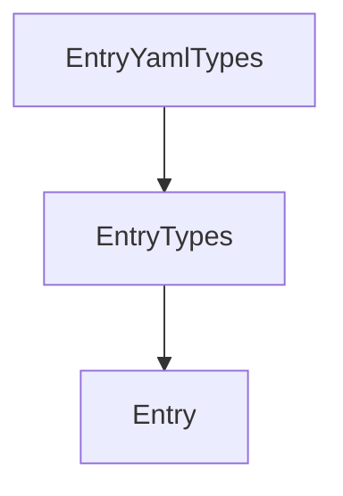

<!-- markdownlint-disable-file -->
# Design Document: KodexB

## OVERVIEW

**KodexB** is a terminal knowledge system on [Bun][1] and [TypeScript][2], using **Functional Core, Imperative Shell (FCIS)**:

| **LAYER**     | **LOCATION**               | **RESPONSIBILITY**                                    |
| ------------- | -------------------------- | ----------------------------------------------------- |
| Core (pure)   | `apps/kb/src/core`         | Types, parsers, validators, formatters — no I/O       |
| Shell (I/O)   | `apps/kb/src/shell`        | CLI (KLI), config load, SQLite, import, debug logging |
| CLI framework | `packages/kli` (`@kb/kli`) | Parsing, commands, middleware, optional TUI hook      |

YAML sources are the source of truth; SQLite is a derived, rebuildable index.

---

### ARCHITECTURE DECISION

**DECISION:**

- KodexB is a **dedicated Bun package** at **`apps/kb`** in the monorepo.
- FCIS layers stay at **`apps/kb/src/core`** (pure) and **`apps/kb/src/shell`** (I/O).
- The CLI framework is shared from **`@kb/kli`** in the monorepo.
- **No `packages/kb` library** until a future split is explicitly needed.

**RATIONALE:**

- Isolates the product app from other workspace packages.
- The production binary compiles from `apps/kb/src/shell/cli/entry/main.headless.ts`
  so **OpenTUI never enters** the compile graph.
- The dev entry `apps/kb/src/shell/index.ts` may attach TUI only when
  `KB_HEADLESS_BUILD` is unset.

---

### STABLE IDENTITY

Entry IDs are deterministic: `crc32(type + ":" + yamlKey)`. Rebuilds never
change IDs, so external scripts and shell aliases remain valid across imports.

---

### SCHEMA LAYERS ([Typia][2])

Validation is compile-time via [Typia][2]. JSON Schema files under
`assets/schemas/` are generated IDE-facing artifacts — never read at runtime.



- **EntryYamlTypes** — validates raw YAML during import.
- **EntryTypes** — adds `id` (crc32), `source` path, timestamps.
- **Entry** — the domain shape consumed by the CLI and formatters.

---

## KEY DESIGN PRINCIPLES

1. **App service as orchestrator** — `apps/kb/src/shell/app/app.service.ts`
   is the single interface for all application actions (import, list, view,
   stats). KLI commands call the app service only. Commands NEVER open SQLite
   directly — that is exclusively the app service's responsibility.

2. **Thin commands** — Each command: validates input via KLI schema, calls
   the app service, passes the result to the emitter. No domain logic, no
   repository access, no formatting inline.

3. **Emitter** — A single module at
   `apps/kb/src/shell/cli/emitter/emitter.ts` responsible for writing
   structured data to stdout in the requested format. Every command delegates
   all stdout writing to the emitter. The emitter accepts a typed payload and
   a `Format` value and produces the correct output. It is the only place in
   the shell that calls `console.log` for data output.

4. **Headless vs dev entry** — Production: `main.headless.ts` (no TUI
   dependency). Development: `index.ts` (may attach TUI). The `format` global
   flag is wired by the emitter, not by individual commands.

---

## REPOSITORY STRUCTURE (TARGET)

```tree
assets/
  docs/specs/kb/              # requirements.md, design.md, tasks.md, gap-matrix.md
  fixtures/kb/                # named fixture corpora for performance tests
  schemas/                    # generated JSON schemas (IDE tooling only)
apps/kb/                      # Bun package: KodexB CLI
  package.json
  src/
    core/                     # pure domain (no I/O)
      config/                 # ResolvedConfig type, defaults, Typia validator
      domain/
        types/                # Entry, EntryType, LinkItem, NoteBlock
        parsers/              # entry, link, note parsers
        formatters/           # entry, config formatters (pure)
        validators/           # Typia-based validators
    shell/                    # imperative I/O
      app/
        app.service.ts        # single orchestrator: import, list, view, stats
        db/                   # Drizzle schema, client, repository
      config/
        config.loader.ts      # loadConfig() — file I/O, Bun.YAML.parse
      cli/
        commands/             # one file per command: config, import, ls, view, db, cache
        emitter/
          emitter.ts          # formatAndWrite(payload, format): void
          formats.ts          # Format type: 'pretty' | 'json' | 'raw'
        entry/
          definition.kli.ts   # withCli(pkg, { globals, middleware, commands })
          main.headless.ts    # production entry point
          main.run.ts         # shared run() bootstrap
        middleware/           # KLI middleware (timing, debug)
      index.ts                # dev entry (optional TUI attachment)
packages/
  kli/                        # @kb/kli — CLI micro-framework
package.json                  # workspace root
tsconfig.base.json            # workspace root
```

> **NOTE:** Legacy or transitional code may still exist under the repository
> root `src/` during migration into `apps/kb`. Specs describe the target
> layout above. Treat paths under `apps/kb/src/` as canonical.

---

## OUTPUT FORMAT

The global `--format` flag is available on every command that writes data to
stdout. It is wired by the emitter, not by individual commands.

| **Value** | **Description**                           |
| --------- | ----------------------------------------- |
| `pretty`  | Human-readable, aligned columns (default) |
| `json`    | JSON array or object, machine-readable    |
| `raw`     | TSV — one record per line, tab-separated  |

Commands that produce no data output (e.g. `config --setup`) respect
`--format` for any summary line they emit.

---

## DATA FLOW

### 1. IMPORT

```
sources/**/*.yaml
  → Bun.YAML.parse()
  → Typia validate (EntryYamlTypes)
  → derive stable id: crc32(type + ":" + key)
  → normalise links and notes
  → upsert knowledges table
  → rebuild FTS5 virtual table
```

### 2. QUERY (`ls`, `view`)

```
argv
  → KLI parse + validate
  → withCommand run(ctx)
  → app.service.ts
  → repository (SQLite / optional cache)
  → emitter.formatAndWrite(payload, ctx.opts.format)
  → stdout
```

### 3. OBSERVABILITY

**Debug flag (`-d` / `--debug`):** a global flag. When set, structured log
lines are written to **stderr** (never stdout) in the format:

```
ts=<ISO> phase=<label> label=<description> dur_ms=<number>
```

Recognised phase labels:

| **Phase**       | **When emitted**                             |
| --------------- | -------------------------------------------- |
| `config_load`   | After config file is read and validated      |
| `config_reload` | After `config --sync` reloads from disk      |
| `sqlite`        | After each SQLite query                      |
| `import`        | After each file processed during import      |
| `cache_hit`     | When a query result is served from cache     |
| `cache_miss`    | When cache is bypassed and SQLite is queried |

The `--debug` flag is **global only**. Individual commands do not declare
their own `--debug` flag. A command that wants to force debug output for its
own path SHALL do so by reading `ctx.opts.debug` from the global context.

**Timing middleware:** KLI timing middleware records and emits total command
wall time to stderr when `--debug` is set.

### 4. PERFORMANCE ARCHITECTURE (NFR)

| Layer        | What is measured                  | Hook                                                |
| ------------ | --------------------------------- | --------------------------------------------------- |
| Process      | Cold start → stdout flushed       | `time`, CI script, `performance.now()` in e2e tests |
| Command      | Per-command wall time after parse | KLI timing middleware                               |
| Config / I/O | Path resolution, file read        | Debug phase `config_load`                           |
| SQLite / FTS | Query and import duration         | Debug phases `sqlite`, `import`                     |

**CLI responsiveness definition:** elapsed time from process start until all
intended stdout for that invocation is written — not time-to-first-byte,
unless a specific requirement says otherwise.

---

## CLI SURFACE (KLI)

Definition file: `apps/kb/src/shell/cli/entry/definition.kli.ts`.

### Global options

| **Long**   | **Short** | **KLI type** | **Default**                    | **Description**            |
| ---------- | --------- | ------------ | ------------------------------ | -------------------------- |
| `--config` | `-c`      | `file`       | `~/.config/kodexb/config.yaml` | Config file path           |
| `--source` | `-s`      | `file`       | `~/.config/kodexb/sources/`    | Sources directory          |
| `--db`     | `-b`      | `file`       | `~/.config/kodexb/db.sqlite`   | SQLite database path       |
| `--debug`  | `-d`      | `boolean`    | `false`                        | Structured debug to stderr |
| `--format` | `-f`      | `either`     | `pretty`                       | Output format              |

> `--format` uses KLI's `either` group: `-p` / `--pretty`, `-j` / `--json`,
> `-r` / `--raw`. Wired by the emitter.

### Repeatable flags

KLI's parser stores one value per key. For multiple values, use
comma-separated strings:

- `--tags=vim,sql` — AND semantics
- `--types=command,cheat`

### Command map

| **Command** | **Requirement** | **Description**                       |
| ----------- | --------------- | ------------------------------------- |
| `config`    | V1-1            | Show, setup, and sync configuration   |
| `import`    | V1-2            | Import YAML sources into SQLite       |
| `ls`        | V1-3            | List and search entries               |
| `view`      | V1-4            | View one entry by stable id           |
| `db`        | V1-5            | Database statistics                   |
| `cache`     | V1-6 `*`        | Query cache statistics and invalidate |

> `*` — `cache` is optional for MVP. Requires query cache to be implemented.

---

## DATABASE

- **Engine:** SQLite via `bun:sqlite` or Drizzle ORM.
- **Primary table:** `knowledges` — one row per entry.
- **FTS5 virtual table:** `knowledges_fts` with
  `content='knowledges', content_rowid='id'`.
- Schema file: `apps/kb/src/shell/app/db/schema.ts`.

### In-memory query cache (optional, v1)

If implemented, the cache is a simple `Map<string, Entry[]>` keyed by
normalised query string. It lives in the app service and is invalidated by
`kb cache --invalidate`. Debug phases `cache_hit` and `cache_miss` are
emitted when `--debug` is set.

---

## CONFIG LIFECYCLE

The resolved config is computed once at process startup by `loadConfig()` and
held in memory for the duration of that process. There is no singleton — the
config object is passed top-down as a plain argument via `ctx.deps`.

`kb config --sync` forces a fresh `loadConfig()` call and writes the result
back into the running process's deps. This is a developer convenience for
long-running dev sessions; in normal CLI use, each invocation is a fresh
process.

---

## CORRECTNESS PROPERTIES

| **Property**                     | **Validates**                     |
| -------------------------------- | --------------------------------- |
| Import idempotency               | REQUIREMENT V1-2                  |
| Stable ID across rebuilds        | REQUIREMENT V1-2, stable identity |
| FTS consistency post-import      | REQUIREMENT V1-3                  |
| Config path expansion (`~`, env) | REQUIREMENT V1-1                  |

---

## TESTING

- **Unit:** core parsers, validators, id derivation, formatters — no mocks,
  no async, plain data in / assertions out.
- **Integration:** in-memory SQLite (`:memory:`); full import → ls → view
  pipeline with fixture data.
- **CLI (e2e):** `runAndCaptureStdout` patterns; assert exit codes, stdout
  shape per `--format`, and stderr debug line format.
- **Performance:** bounded fixtures under `assets/fixtures/kb/`; `Measure:`
  lines in requirements.md define thresholds — optional CI job.

---

## RELATED SPECS

- [requirements.md](requirements.md) — behaviour + NFR Measure lines
- [tasks.md](tasks.md) — implementation checkpoints
- [gap-matrix.md](gap-matrix.md) — REQ vs code vs legacy REQ 0–10
- [sdd-review-report.md](sdd-review-report.md) — Keep / Change / Add audit

---

## REFERENCES

- [Bun][1]
- [Typia][2]
- [Drizzle ORM][3]
- [CLIG — Command Line Interface Guidelines][4]
- [Docopt — Command-line interface description language][5]

[1]: https://bun.sh 'Bun - JavaScript runtime'
[2]: https://typia.io 'Typia - TypeScript validation'
[3]: https://orm.drizzle.team 'Drizzle ORM'
[4]: https://clig.dev 'CLIG - Command Line Interface Guidelines'
[5]: https://docopt.org 'Docopt - Command-line interface parser'