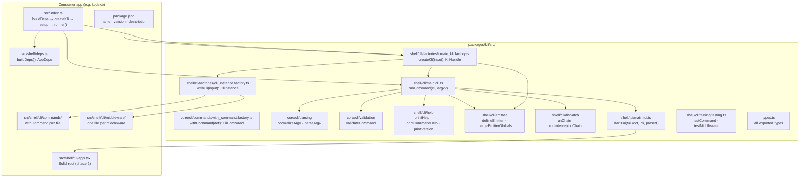

<!-- markdownlint-disable-file -->
# Design Document: kli

## Overview

`kli` is a CLI micro-framework for Bun/TypeScript. It is intentionally
minimal: option parsing, validation, middleware, command dispatch, help text
generation, and a clean TTY/pipe branch. Nothing else.

The mental model is a straight line:

```
createKli({ packageJson, deps, globals, middleware, interceptors })
  → setup({ commands, emitter?, tui? })()
    → runCommand()
    → parse argv
    → validate
    → middleware chain
    → interceptor chain (emitter → global → command)
    → command.run({ args, opts, globals, deps, raw })
```

There is no container. There is no lifecycle hook. There is no magic.
Every operation is traceable in one step.

---

## KEY DESIGN PRINCIPLES

1. **The key is always the long flag name** — `config: { short: 'c', ... }`
   is unambiguous. No positional conventions, no "first key" assumptions.
   Short/long relationship declared once, in one place.

2. **Deps are yours** — `buildDeps()` runs in your `index.ts`. You pass the
   result to `withCli`. kli carries it, untouched, into every middleware and
   command handler as `ctx.deps`. No factory pattern, no container, no magic
   about when or how services are constructed.

3. **`ctx` is the whole world** — every handler and middleware receives one
   object: `{ args, opts, deps, raw }`. Named args (never `_args[0]`). Merged
   opts (global + local, typed). Your deps (exactly as built). Raw argv (for
   escape hatches). Nothing else needed.

4. **`run()` owns the lifecycle** — parsing, validation, middleware, dispatch,
   TTY detection, help text, error handling. All of it. Your `index.ts` builds
   deps, calls `withCli`, calls `run`. Three lines of real work.

5. **`either` for mutually exclusive flags** — `{ p: 'pretty', j: 'json' }`
   declares multiple short flags that resolve to a single typed union value.
   No manual mutual exclusivity checking, no branching on multiple booleans.

6. **Generated help, always** — help text is derived from `withCommand` and
   `withCli` declarations plus `package.json`. Never written by hand. Never
   out of sync.

7. **Two libs, internal only** — `neverthrow` for typed error propagation
   inside `run()`; `radash` for parsing utilities. Neither leaks into the
   public API surface.

---

## Architecture



---

## Package Structure

```
kb/                                        ← Bun workspace root
├── package.json                           ← { "workspaces": ["packages/*"] }
├── bun.lock
├── catalog.yaml                           ← Bun catalog: shared dev dep versions
├── mise.toml
├── biome.json
├── tsconfig.base.json
│
└── packages/
    ├── kli/
    │   ├── package.json
    │   ├── tsconfig.json
    │   └── src/
    │       ├── index.ts                   ← public API
    │       ├── types.ts                   ← all exported types
    │       ├── with-cli.ts
    │       ├── with-command.ts
    │       ├── with-tui.ts
    │       ├── shell/cli/dispatch/main.cli.ts
    │       ├── shell/cli/… (help, emitter, factories, testing)
    │       ├── shell/tui/main.tui.ts
    │       └── __tests__/
    │           ├── parse-argv.spec.ts
    │           ├── validate.spec.ts
    │           ├── run.spec.ts
    │           └── testing.spec.ts
    │
    └── kodexb/
        └── src/
            ├── index.ts                   ← entry point
            ├── core/
            └── shell/
                ├── deps.ts
                ├── cli/
                │   ├── commands/
                │   └── middleware/
                └── tui/
                    └── app.tsx
```

---

## Bun Workspace and Catalog

```json
// kb/package.json
{
  "name":       "kb-workspace",
  "private":    true,
  "workspaces": ["packages/*"]
}
```

```yaml
# kb/catalog.yaml — pin shared dev dep versions once
dependencies:
  "@biomejs/biome": "^1.9.0"
  "@types/bun":     "^1.2.0"
  "typescript":     "^5.7.0"
```

```json
// packages/kli/package.json
{
  "name":    "@kb/kli",
  "version": "0.1.0",
  "module":  "src/index.ts",
  "exports": {
    ".":         "./src/index.ts",
    "./testing": "./src/testing.ts"
  },
  "dependencies": {
    "neverthrow": "^8.0.0",
    "radash":     "^12.0.0"
  },
  "peerDependencies": {
    "@opentui/core": "*",
    "@opentui/solid": "*",
    "solid-js":      "*"
  },
  "peerDependenciesMeta": {
    "solid-js": { "optional": true }
  },
  "devDependencies": {
    "@biomejs/biome": "catalog:",
    "@types/bun":     "catalog:",
    "typescript":     "catalog:"
  }
}
```

```json
// packages/kodexb/package.json
{
  "name":    "kodexb",
  "version": "0.1.0",
  "dependencies": {
    "@kb/kli": "workspace:*"
  },
  "devDependencies": {
    "@biomejs/biome": "catalog:",
    "@types/bun":     "catalog:",
    "typescript":     "catalog:"
  }
}
```

---

## Public API

```typescript
// packages/kli/src/index.ts

export { createKli } from '@kli/shell/cli'

export type {
  CreateKliInput,
  KliHandle,
  KliSetupOptions,
} from '@kli/shell/cli'
```

```typescript
// packages/kli/src/testing.ts  ← separate entry, never in production
export { testCommand, testMiddleware } from './shell/cli/testing/testing'
```

---

## Types

```typescript
// packages/kli/src/types.ts

// ─── Argument definitions ─────────────────────────────────────────────────────

export type ArgDef = {
  type:      'string' | 'number' | 'boolean'
  required?: boolean
  desc?:     string
}

export type ArgsDef = Record<string, ArgDef>

// ─── Option definitions ───────────────────────────────────────────────────────

export type EitherDef = {
  either:   Record<string, string>   // { p: 'pretty', j: 'json', ... }
  default?: string
  required?: boolean
  desc?:    string
}

export type ScalarOptDef = {
  short?:    string
  type:      'string' | 'number' | 'boolean' | 'file'
  default?:  string | number | boolean
  required?: boolean
  desc?:     string
  env?:      string
}

export type OptDef    = ScalarOptDef | EitherDef
export type OptsDef   = Record<string, OptDef>
export type GlobalsDef = OptsDef

// ─── Resolved types ───────────────────────────────────────────────────────────

// Resolves ArgsDef → { NAME: string, 'files...': string[] }
export type ResolveArgs<A extends ArgsDef> = {
  [K in keyof A]: K extends `${string}...`
    ? string[]
    : A[K]['type'] extends 'number'  ? number
    : A[K]['type'] extends 'boolean' ? boolean
    : string
}

// Resolves OptsDef → { config: string, limit: number, format: 'pretty'|'json' }
export type ResolveOpts<O extends OptsDef> = {
  [K in keyof O]: O[K] extends EitherDef
    ? O[K]['either'][keyof O[K]['either']]
    : O[K] extends ScalarOptDef
      ? O[K]['type'] extends 'number'  ? number
      : O[K]['type'] extends 'boolean' ? boolean
      : string
    : never
}

// ─── Context ──────────────────────────────────────────────────────────────────

export type Ctx<
  D,
  G  extends GlobalsDef,
  A  extends ArgsDef,
  O  extends OptsDef,
> = {
  args: ResolveArgs<A>
  opts: ResolveOpts<G & O>   // global + local, local wins on conflict
  deps: D
  raw:  string[]
}

// ─── Middleware ───────────────────────────────────────────────────────────────

export type Middleware<D, G extends GlobalsDef> = (
  ctx:  Ctx<D, G, ArgsDef, OptsDef>,
  next: () => Promise<void>,
) => Promise<void>

// ─── Command ──────────────────────────────────────────────────────────────────

export type Command<D, G extends GlobalsDef> = {
  desc:        string
  args?:       ArgsDef
  opts?:       OptsDef
  middleware?: Middleware<D, G>[]
  run:         (ctx: Ctx<D, G, ArgsDef, OptsDef>) => Promise<void>
}

// ─── CLI instance ─────────────────────────────────────────────────────────────

export type CliInstance<D, G extends GlobalsDef> = {
  pkg:        { name: string; version: string; description?: string }
  globals:    G
  deps:       D
  middleware: Middleware<D, G>[]
  commands:   Record<string, Command<D, G>>
  tui?:       (props: { deps: D; globals: ResolveOpts<G> }) => unknown
}
```

---

## `createKli` + `setup`

```typescript
// packages/kli/src/shell/cli/factories/create_kli.factory.ts (shape)
import { createKli } from '@kb/kli'

const shell = createKli({
  name: 'kb',
  packageJson: pkg,
  deps,
  globals,
  middleware: [timingMiddleware],
})

const run = shell.setup({
  commands: [infoCommand, greetCommand],
  emitter: formatEmitterPackage,
  tui: ShellTuiRoot, // optional
})

await run()
```

### Consumer example

```typescript
// packages/greeter/src/index.ts

import { createKli } from '@kb/kli'
import { buildDeps }              from './shell/deps'
import { timingMiddleware }       from './shell/cli/middleware/timing'
import { helloCommand }           from './shell/cli/commands/hello'
import { byeCommand }             from './shell/cli/commands/bye'
import { App }                    from './shell/tui/app'
import pkg                        from '../package.json'

const deps = await buildDeps().catch(err => {
  console.error(err.message)
  process.exit(1)
})

const shell = createKli({
  name: 'greeter',
  packageJson: pkg,
  deps,
  globals: {
    config:  { short: 'c', type: 'file',    desc: 'Config path',  default: '~/.config/greeter/config.yaml', env: 'GREETER_CONFIG' },
    verbose: { short: 'v', type: 'boolean', desc: 'Verbose output', default: false },
    format: {
      either:  { p: 'pretty', j: 'json', y: 'yaml', r: 'raw' },
      default: 'pretty',
      desc:    'Output format',
    },
  },
  middleware: [timingMiddleware],
})

const run = shell.setup({ commands: [helloCommand, byeCommand], tui: App })
await run()
```

---

## `withCommand` (via `shell.withCmd`)

```typescript
// packages/kli/src/with-command.ts

export function withCommand<D, G extends GlobalsDef>(
  def: Command<D, G>
): Command<D, G> {
  return def  // identity — returns plain data, no transformation
}
```

### Consumer example

```typescript
// packages/greeter/src/shell/cli/commands/hello.ts

import type { CliCommand } from '@kb/kli'
import type { AppDeps } from '../../deps'
import type { Globals } from '../globals'

export const helloCommand: CliCommand<AppDeps, {}, {}, Globals> = {
  name: 'hello',
  desc: 'Greet someone by name',

  args: {
    name: { type: 'string', required: true,  desc: 'Person to greet' },
  },

  opts: {
    shout: { short: 's', type: 'boolean', default: false, desc: 'SHOUT the greeting' },
  },

  // per-command middleware — runs after global middleware, before run()
  middleware: [uppercaseMiddleware],

  run: async ({ args, opts, globals, deps }) => {
    // args.name:   string         ← named, typed, never _args[0]
    // opts.shout:  boolean        ← local opt
    // opts.format: 'pretty'|...   ← global opt, merged in automatically
    // globals.format: 'pretty'|... ← global-only slice
    // deps:        AppDeps        ← exactly what you passed to withCli
    const greeting = deps.greeter.greet(args.name)
    console.log(opts.shout ? greeting.toUpperCase() : greeting)
  },
}
```

---

## TUI (`setup({ tui })`)

TUI imports are dynamic inside `startTui` — pipe mode pays zero cost. When
`tui` is omitted, TTY + no subcommand shows root help like a normal CLI.

---

## Middleware

```typescript
// packages/greeter/src/shell/cli/middleware/timing.ts

import type { Middleware } from 'kli'
import type { AppDeps }    from '../../deps'
import type { Globals }    from '../globals'

export const timingMiddleware: Middleware<AppDeps, Globals> = async (
  ctx,
  next,
) => {
  const start = performance.now()
  await next()
  if (ctx.opts.verbose) {
    console.error(`↳ ${(performance.now() - start).toFixed(1)}ms`)
  }
}
```

**Why middleware has no DI problem here:**
`ctx.deps` is fully populated before `run()` is ever called. `buildDeps()`
runs in `index.ts`, the result is passed to `withCli`, and `run()` carries
it into every middleware and handler as `ctx.deps`. The framework calls
`middleware(ctx, next)` — deps arrive as a plain property of `ctx`. No
temporal gap, no store, no container.

---

## `runCommand` — The Pipeline

```typescript
// packages/kli/src/shell/cli/main.cli.ts (high level shape)
// - parse argv
// - handle help/version
// - if no subcommand: TUI when configured and TTY, else help
// - validate
// - build ctx: { args, opts, globals, deps, raw }
// - run middleware chain
// - run interceptor chain (emitter interceptor + global + command)
// - call command.run(ctx)
```

---

## Option Parsing Examples

### Scalar options

```
--config=/path/to/config.yaml   → opts.config = '/path/to/config.yaml'
-c /path/to/config.yaml         → opts.config = '/path/to/config.yaml'
--limit 50                      → opts.limit  = 50  (number coercion)
--verbose                       → opts.verbose = true
--no-verbose                    → opts.verbose = false
```

### `either` options

```
-p          → opts.format = 'pretty'
--pretty    → opts.format = 'pretty'
-j          → opts.format = 'json'
--format json → opts.format = 'json'
-p -j       → error: --format flags are mutually exclusive
```

### `file` type

```
--config ~/my/config.yaml       → opts.config = '/home/user/my/config.yaml'
$GREETER_CONFIG (env fallback)  → opts.config = expanded env value
```

### Variadic args

```
greeter hello Alice Bob Carol   → args.name = ['Alice', 'Bob', 'Carol']
```
*(when declared as `'names...': { type: 'string' }`)*

---

## Help Text (generated)

```
greeter 0.1.0  ·  Greet people from the terminal

Usage: greeter <command> [opts]

Commands:
  hello   Greet someone by name
  bye     Say goodbye

Options:
  -h, --help        Show this help and exit
      --version     Show version and exit
  -c, --config      Config path  (default: ~/.config/greeter/config.yaml)  [env: GREETER_CONFIG]
  -v, --verbose     Verbose output  (default: false)
  -p, --pretty
  -j, --json
  -y, --yaml         Output format  (default: pretty)
  -r, --raw
```

---

## Testing Utilities

```typescript
// packages/kli/src/testing.ts

export async function testCommand<D, G extends GlobalsDef, A extends ArgsDef, O extends OptsDef>(
  command: Command<D, G>,
  ctx:     Ctx<D, G, A, O>,
): Promise<{ stdout: string; stderr: string; exitCode: number }>

export async function testMiddleware<D, G extends GlobalsDef>(
  middleware: Middleware<D, G>,
  ctx:        Ctx<D, G, ArgsDef, OptsDef>,
): Promise<{ stdout: string; stderr: string; exitCode: number; nextCalled: boolean }>
```

### Consumer example

```typescript
// packages/greeter/src/shell/cli/commands/hello.spec.ts

import { describe, test, expect } from 'bun:test'
import { testCommand }            from 'kli/testing'
import { helloCommand }           from './hello'
import { makeCtx }                from '../../../__tests__/factories/ctx.factory'

describe('helloCommand', () => {
  const subject = (overrides?: Parameters<typeof makeCtx>[0]) =>
    testCommand(helloCommand, makeCtx(overrides))

  test('greets with provided name', async () => {
    const { stdout, exitCode } = await subject({ args: { name: 'Alice' } })
    expect(exitCode).toBe(0)
    expect(stdout).toContain('Alice')
  })

  test('shouts when --shout is given', async () => {
    const { stdout } = await subject({ args: { name: 'Alice' }, opts: { shout: true } })
    expect(stdout).toBe('HELLO, ALICE!\n')
  })

  test('exits 1 when handler throws', async () => {
    const { exitCode, stderr } = await subject({ deps: makeBrokenDeps() })
    expect(exitCode).toBe(1)
    expect(stderr).toBeTruthy()
  })
})
```

---

## Error Handling

| Situation              | Behaviour                                         |
| ---------------------- | ------------------------------------------------- |
| `buildDeps` throws     | caught in consumer `index.ts`, stderr, exit 1     |
| `parseArgv`            | never throws — returns structured result          |
| Required arg missing   | `run()` prints error per missing arg, exit 1      |
| Required opt missing   | `run()` prints error per missing opt, exit 1      |
| `either` conflict      | `run()` prints mutual exclusivity error, exit 1   |
| Unknown command        | `run()` stderr, exit 1                            |
| Middleware throws      | `run()` catches, stderr with context, exit 1      |
| Command handler throws | `run()` catches, stderr with command name, exit 1 |
| `startTui` fails       | uncaught — OpenTUI handles it                     |

Exit codes: `0` = success, help, or version. `1` = any error.

---

## What kli is NOT

- **Not a DI container** — deps are a plain typed object you build and pass in
- **Not a semantic validator** — kli validates flag structure (type, choices,
  required, file URI); semantic validation belongs in `buildDeps`
- **Not configurable beyond this document** — if you need more, you have
  outgrown kli

---

## References

- [Bun Workspaces](https://bun.com/docs/pm/workspaces)
- [Bun Catalogs](https://bun.com/docs/pm/catalogs)
- [OpenTUI](https://opentui.com)
- [Solid.js](https://www.solidjs.com)
- [neverthrow](https://github.com/supermacro/neverthrow)
- [radash](https://radash-docs.vercel.app)
- [CLIG](https://clig.dev)
- [docopt](http://docopt.org)