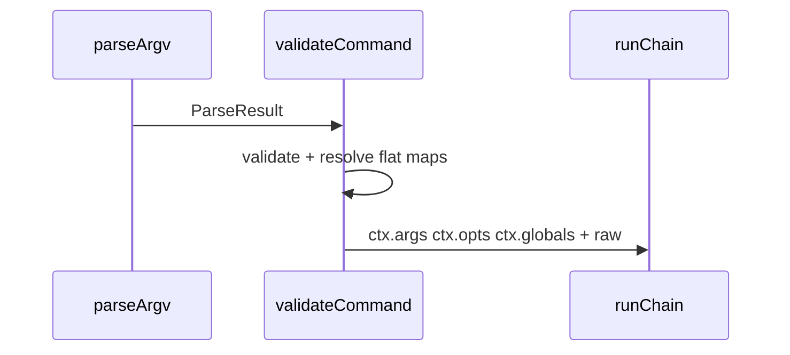

<!-- markdownlint-disable-file -->
# KLI — Typed run context — Design

## TRACEABILITY

| Decision | Requirement |
|----------|-------------|
| Flattened `args` / `opts` / `globals` | 1.1–1.4 |
| Type inference from defs | 2.1–2.2 |
| `raw` parse object on context | 3.1 |
| Tests + app migration | 4.1–4.2 |

---

## DATA MODEL

### Context

- `ctx.args`: resolved positional args map (flat)
- `ctx.opts`: merged resolved options map (flat; globals + local)
- `ctx.globals`: resolved globals-only slice (flat)
- `ctx.deps`: consumer deps (passed through)
- `ctx.raw`: parsed argv object (escape hatch)

---

## PIPELINE

Resolution and validation live in `@kli/core/cli` and are orchestrated by
`@kli/shell/cli`:

1. Parse argv (`normalizeArgv` + `parseArgv`) into a structured `ParseResult`.
2. Early exits: `--help`/`-h` and `--version`.
3. Validate (`validateCommand`) which:
   - enforces required args/opts
   - applies env/default fallbacks where applicable
   - expands `file` values (`~`, `$VAR`)
   - merges globals + local opts into `opts`
   - returns a `globals` slice (global keys only)
4. Build the handler context:
   - `args`, `opts`, `globals`, `deps`, `raw`

---

## TYPING (`with_command.ts`)

The handler context is derived from:
- command `args` and `opts` defs
- CLI `globals` defs

Runtime behavior keeps:
- `ctx.opts`: merged globals + local
- `ctx.globals`: globals-only slice

---

## RISKS

- **`exactOptionalPropertyTypes`**: callers should omit keys rather than pass
  `undefined` in object literals where required by typing.
- **Key shadowing**: when a local opt shares a key with a global opt, the
  merged value is available in `ctx.opts`; `ctx.globals` omits the shadowed
  global key.

---

## MIGRATION

- Read scalar values directly (`opts.format`, `globals.verbose`, `args.name`).
- Use `ctx.raw` when you need parse diagnostics or escape hatches.
