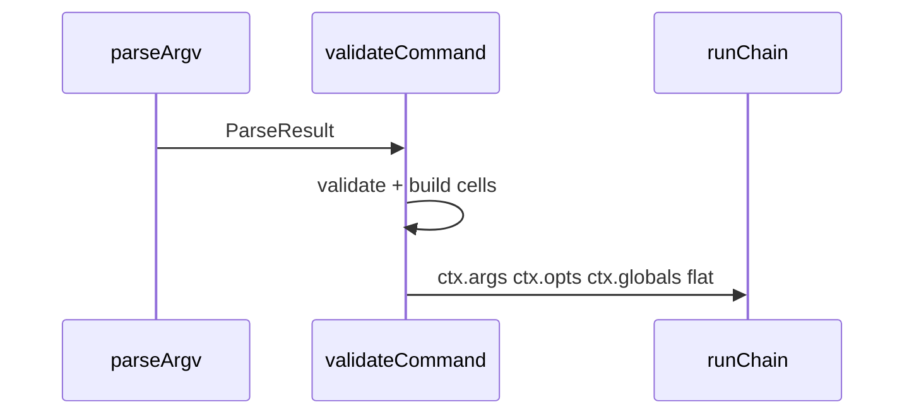

<!-- markdownlint-disable-file -->
# KLI — Typed run context — Design

## TRACEABILITY

| Decision | Requirement |
|----------|-------------|
| Cell shape (`value`, `source`, `isPresent`, `isValid`) | 1.1–1.4 |
| `ResolvedArgsMap` / `ResolvedLocalOptsMap` / `ResolvedGlobalsMap` from defs | 2.1–2.2 |
| Flat `globals` on context | 3.1 |
| Tests + app migration | 4.1–4.2 |

---

## DATA MODEL

### Cell

```ts
type ValueSource = 'argv' | 'env' | 'default' | 'unset'

type ResolvedScalarCell<T> = {
  value: T | undefined
  source: ValueSource
  isPresent: boolean
  readonly isValid: true
}
```

- **argv**: present in `ParseResult.opts` or positional args for declared keys.
- **env**: not argv; `OptDef.env` set and env var present and coerced.
- **default**: schema `default` applied (file defaults expanded like
  `parse_argv` / `applyFallbacks`).
- **unset**: optional opt or arg absent, no default.

### Context

- `ctx.args`: `ResolvedArgsMap<ArgsT>`
- `ctx.opts`: `ResolvedLocalOptsMap<OptsT>` (command `opts` only).
- `ctx.globals`: `ResolvedGlobalsMap<GlobalsT>` (CLI `createKli` `globals` only; keys
  shadowed by command `opts` appear only under `ctx.opts` at runtime).

---

## PIPELINE

Validation stays in [`packages/kli/src/validate_command.ts`](../../../../../packages/kli/src/validate_command.ts).

1. Collect validation errors as today (required args/opts, file empties,
   either conflicts from parse).
2. Build arg cells from `parsed.args` + `command.args` (+ optional arg
   `default` if added to `ArgDef`).
3. Build opt cells from merged defs + `parsed.opts` + env, same resolution
   order as today: argv → env → default.
4. Attach unknown `parsed.opts` keys not in merged defs as `argv` cells
   (parity with previous “copy extras” loop).
5. Split flattened opt values into `opts` (command keys) and `globals` (global
   keys not shadowed by command `opts`).



---

## TYPING (`with_command.ts`)

- Export `RunHandlerContext<DepsT, ArgsT, OptsT, GlobalsT>`.
- `CliCommand.run` and `middleware` use that context.
- Global CLI middleware in `with_cli` remains widened to
  `Record<string, unknown>` for args/opts where needed so app middleware need
  not import every command’s arg map; runtime still passes full ctx (timing
  uses `ctx.opts.verbose.value`).

---

## RISKS

- **`exactOptionalPropertyTypes`**: mapped types must align optional keys.
- **Circular types**: middleware in `cli_kit` must not import `AppCliGlobals`
  from the same module that imports middleware; timing middleware uses a
  minimal `{ verbose?: boolean }` slice or reads `.value` on the cell.

---

## MIGRATION

- Replace `opts.x` with `opts.x.value`; branch on `opts.x.source` /
  `opts.x.isPresent` as needed.
- Replace `args.x` with `args.x.value` for scalars; variadic: `args.x.value`
  is array.
